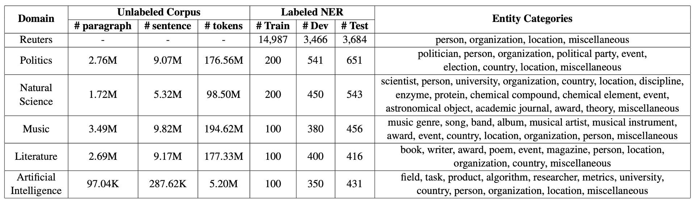

# Task Specific Encoder (SLM-based)

## Environment Setup

**Python Version**
- Python > 3.10

**Required Packages**
- [GliNER](https://github.com/urchade/GLiNER)
```bash
pip install gliner
```

## How to run the code

run the main script with
```bash
python run_GliNER.py --data [DATASET]
```

The `[DATASET]` cold be one of `ai, literature, music, politics, science`


## Data and Output Paths

**Input Data**:
- Location `/datasets/crossner/[domain]`
- Domains: ai, literature, music, politics, science
    - Qi: I am processing MIT-Res and MIT-Movie datasets.
- Data STAT:



**Please note that, we can use both train and dev for the training**, so if the train.json only has 100 samples, we can add dev.json as training data.

**Output**
- All checpoints, training config will be saved under `./ckpts`
- The prediction results will be saved under `./output/gliner/`


## Run NuNER

**[NuNER](https://github.com/Serega6678/NuNER)** is another popular task specific encoder for the NER, which is published on EMNLP 2024. 
`GliNER` has intergrated the **NuNER**

Please look this [Example Jupyter notebook.](finetune_NuNerZero.ipynb).
